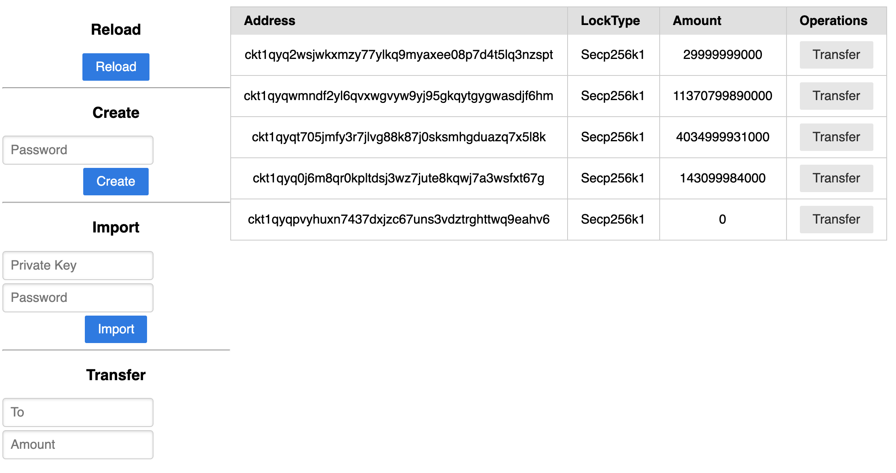

为CKB开发dApp是一件非常有意思的任务，遗憾的是目前还没有在CKB上开发dApp的最佳实践，[xuejie](https://github.com/xxuejie) 的 [Animagus](https://github.com/xxuejie/animagus) 是CKB dApp的开发框架，本文尝试用另外一种原始的手工组装交易的方式介绍CKB dApp与基于 [Keyper](https://github.com/ququzone/keyper) 规范的钱包的交互模式。

## Keyper

[Keyper](https://github.com/ququzone/keyper) 是 Nervos 基金会提出的钱包管理 LockScript 的规范，由于 CKB 主链灵活的架构设计，等主链生态繁荣起来之后会有种类繁多额 LockScript 来为用户管理 CKB 的归属权，但是各种钱包要支持这些丰富多彩的 LockScript 将会是一项比较有挑战的工作，基于上述问题，基金会提出了 Keyper 规范，为钱包和 LockScript 之间提出了规范定义，统一钱包和 LockScript 的交互模式，便于钱包快速的支持各种有趣的 LockScript。

目前 [Keyper](https://github.com/ququzone/keyper) 已经完成了第一版的设计，实现语言是 [TypeScript](https://www.typescriptlang.org/)，但是 Keyper 的设计初衷是一个规范定义，不同的钱包也可以基于 Keyper 的规范实现自定义的 Keyper 实现。目前已经实现的 Keyper 包含两个子项目：[specs](https://github.com/ququzone/keyper/tree/master/packages/specs) 和 [contianer](https://github.com/ququzone/keyper/tree/master/packages/container)。specs 是 LockScript 规范定义以及工具类支持，container 是钱包侧如何支持 LockScript 的流程。

### Keyper specs

[Keyper specs](https://github.com/ququzone/keyper/tree/master/packages/specs) 中最主要的接口定义是 LockScript，该接口定义了实现一个自定义的 LockScript 需要支持的方法。

```
interface LockScript {
  readonly name: string;
  readonly codeHash: Hash256;
  readonly hashType: ScriptHashType;
  setProvider(provider: SignProvider): void;
  script(publicKey: string): Script;
  deps(): CellDep[];
  headers?(): Hash256[];
  signatureAlgorithm(): SignatureAlgorithm;
  sign(context: SignContext, rawTx: RawTransaction, config: Config): Promise<RawTransaction>;
}
```

### Keyper container

[Keyper contianer](https://github.com/ququzone/keyper/tree/master/packages/container) 是自定义 LockScript 的装载容器，主要是安装在钱包侧。并且内置了 [Secp256k1 LockScript](https://github.com/ququzone/keyper/blob/master/packages/container/src/locks/secp256k1/index.ts) 的实现。

上述两个子项目均已发不到 npm 中，可以通过下述命令安装：

```
npm i @keyper/specs -S
npm i @keyper/container -S
```

## Keyper Scatter

[Keyper Scatter](https://github.com/ququzone/keyper-scatter) 是为了支持 Keyper 规范开发的一款类似 [EOS Scatter](https://github.com/GetScatter/ScatterDesktop) 的桌面演示钱包（并不没有达到产品化级别）。Keyper Scatter 完全实现了 Keyper 定义的规范，并提供了与dApp通信的接口。

在Keyper Scatter中，dApp 与 Keyper Scatter 交互通过 WebSocket 来实现，主要包括获取钱包中的账户信息和签名交易，对于 CKB 来说，账户信息主要就是钱包管理的 Lock 列表。另外Keyper Scatter在又启动了一个 HttpServer 来提供live cell查询功能，这个接口是 [ckb-cache-js](https://github.com/ququzone/ckb-cache-js) 接口的 http 封装，提供 HttpServer 接口的主要目前是方便 dApp 组装交易，这个功能也可以由 dApp自己的服务器来实现，所以在 Keyper 的规范定义中也没有对 live cell 的定义。

### 启动

```
git clone https://github.com/ququzone/keyper-scatter.git
cd keyper-scatter
npm install
npm run start
```

在 Keyper Scatter 启动之后，需要设置应用的密码，这个密码在每次打开应用的时候都要输入，设置密码后进入主界面，在这个界面可以创建一个 Key，创建的同时也需要一个密码，这个密码是为了保护私钥，每次签名时需要该密码。Keyper Scatter启动成功后的界面如下：



## Simple UDT dApp

有了上述 Keyper 规范和 Keyper Scatter 的钱包实现，我们就可以基于 Keyper Scatter 来开发和调试 dApp 应用了，下面介绍如何开发一个 UDT dApp，UDT目前已经提出了[规范草案](https://talk.nervos.org/t/rfc-simple-udt-draft-spec/4333)，我们 dApp 就是基于这个草案的一种实现。在 UDT dApp中，我们将演示如何发行、销毁、转移 UDT。

针对 Simple UDT dApp 这个应用，开发流程如下：

1. 开发 UDT 合约 https://github.com/ququzone/ckb-minimal-udt/blob/master/src/udt.c 

2. 部署 UDT 合约 https://github.com/ququzone/ckb-minimal-udt/blob/master/deploy/deployer.go

3. 开发 UDT dApp  

    - 获取账号信息
    - 组装交易
    - 签名交易
    - 发送交易

上述开发流程中，开发 UDT、部署 UDT合约以及UDT合约的功能不再详述，这个在之前 xuejie 的文章中都有详细的描述，下面主要介绍 dApp 本身的开发流程。目前合约已经部署在测试网中，合约代码交易是 [0x78fbb1d420d242295f8668cb5cf38869adac3500f6d4ce18583ed42ff348fa64](https://explorer.nervos.org/aggron/transaction/0x78fbb1d420d242295f8668cb5cf38869adac3500f6d4ce18583ed42ff348fa64)，合约的 codeHash 是 `0x48dbf59b4c7ee1547238021b4869bceedf4eea6b43772e5d66ef8865b6ae7212`， hashType 是 `code`。

### 获取账号信息以及展示余额

获取账号信息是 UDT dApp 与 Keyper Scatter交互的第一步，通过 WebSocket 接口来实现，dApp 通过 WebSocket 发送获取账号消息，Keyper Scatter 收到消息之后检查合法请求后发送账户信息给 dApp，dApp收到消息之后在界面展示账户信息。

请求账户消息：

```
42/keyper,["api", {"data": {"origin": "localhost", "payload": {"method": "ALL_LOCKS"}}, "type":"query"}]
```

下面是根据 Keyper Scatter 返回的响应信息组织的界面：


### 发行 UDT

发行 UDT 其实就是组装 UDT transaction的过程，在 dApp 侧，只需要组装出合法的交易，签名功能交由 Keyper Scatter 来实现，签名消息也是通过 WebSocket 接口来通信，签名完成后发送交易上链即可，组装交易需要live cells，这个功能可以通过 Keyper Scatter 提供的 HttpServer 接口来实现，下面是组装交易的过程：

```
async issue() {
  if (this.issueForm.amount <= 0) {
    this.issueFormVisible = false;
    return;
  }
  const _cellCapacity = new BN(14200000000);
  const _fee = new BN(1000);
  const rawTx = {
    version: "0x0",
    cellDeps: [{
      outPoint: {
        txHash: "0x78fbb1d420d242295f8668cb5cf38869adac3500f6d4ce18583ed42ff348fa64",
        index: "0x0"
      },
      depType: "code",
    }],
    headerDeps: [],
    inputs: [],
    outputs: [],
    witnesses: [],
    outputsData: []
  };
  rawTx.outputs.push({
    capacity: `0x${_cellCapacity.toString(16)}`,
    lock: this.issueForm.meta.script,
    type: {
      hashType: "data",
      codeHash: "0x48dbf59b4c7ee1547238021b4869bceedf4eea6b43772e5d66ef8865b6ae7212",
      args: this.issueForm.lock,
    },
  });
  rawTx.outputsData.push(`0x${new BN(this.issueForm.amount).toArrayLike(Buffer, "le", 16).toString("hex")}`);

  const total = _cellCapacity.add(_fee);
  const result = await axios.post("http://localhost:50002", {
    lockHash: this.issueForm.lock,
    typeHash: "null",
    data: "0x",
    capacity: total.toString(),
  });
  for (let i = 0; i < result.data.cells.length; i++) {
    const element = result.data.cells[i];
  
    rawTx.inputs.push({
      previousOutput: {
        txHash: element.txHash,
        index: element.index,
      },
      since: "0x0",
    });
    rawTx.witnesses.push("0x");
  }

  const resultTotal = new BN(result.data.total, 16);
  if (resultTotal.gt(total) && resultTotal.sub(total).gt(new BN(6100000000))) {
    rawTx.outputs.push({
      capacity: `0x${resultTotal.sub(total).toString(16)}`,
      lock: this.issueForm.meta.script
    });
    rawTx.outputsData.push("0x");
  }
  rawTx.witnesses[0] = {
    lock: "",
    inputType: "",
    outputType: "",
  };

  const signObj = {
    target: this.issueForm.lock,
    tx: rawTx,
  };
  
  this.websocketsend(`42/keyper,["api", {"data": {"origin": "localhost", "payload":${JSON.stringify(signObj)}}, "type":"sign"}]`);
}
```

通过上述代码可以看到，dApp 并不需要太多的关注 Lock 相关的详细细节，只需要关注 UDT 本身的交易结构，关于 Lock 相关的 CellDeps、HeaderDeps以及签名的细节其实都有 Keyper来实现。

UDT dApp 中的销毁和转账交易流程与上述发行的流程基本一致，所以不再详述，该 demo 的代码[已经发布](https://github.com/ququzone/ckb-udt-dapp)，具体的详细细节可以参考代码。另外此应用采用的是手工组装交易的模式，有兴趣的可以将其改为由 Animagus 来实现这个功能。
